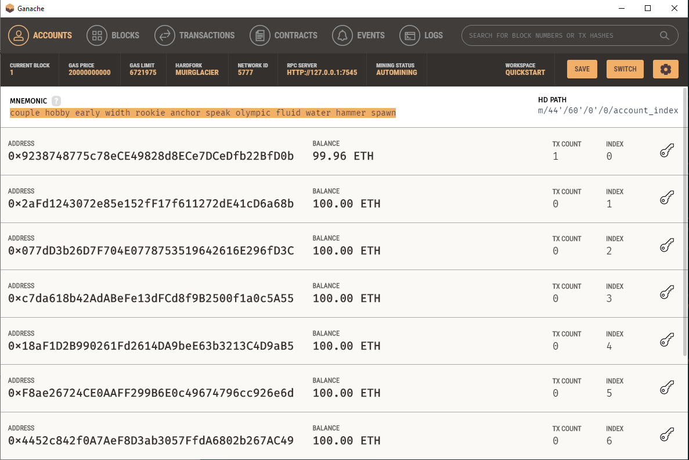
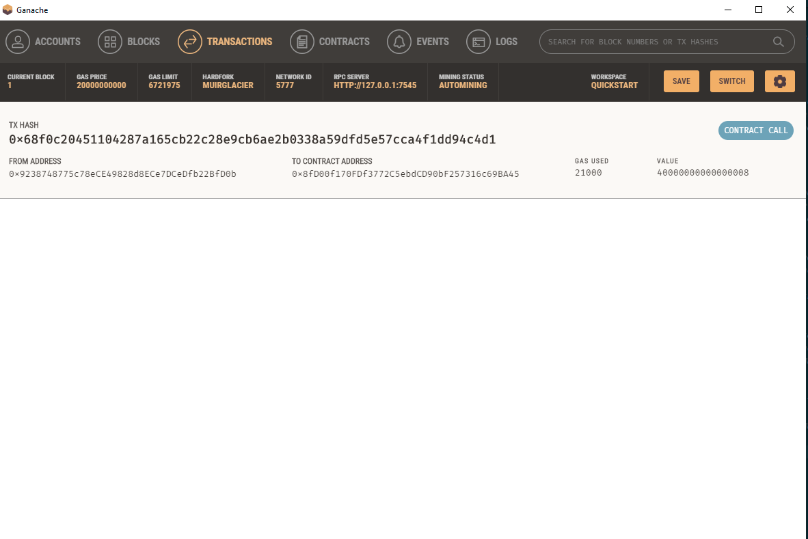

# Challenge19

This is a program that hires a fintech professional and pays them for their services on the blockchain using ether.

---

## Technologies

This project leverages python 3.7 with the following packages:


* [pandas](https://github.com/pandas-dev/pandas) - Flexible and powerful data analysis / manipulation library for Python, providing labeled data structures similar to R data.frame objects, statistical functions, and much more

* [web3](https://github.com/ethereum/web3.py) - A python interface for interacting with the Ethereum blockchain and ecosystem.

* [typing](https://github.com/python/typing) - Python static typing home.  Hosts the documentation and user help forum.

* [streamlit](https://github.com/streamlit) - The fastest way to build custom ML tools

* [eth-tester](https://github.com/ethereum/eth-tester) - Tool suite for testing ethereum applications.

* [mnemonic](https://github.com/apache/mnemonic) - A non-volatile hybrid memory storage oriented library


---

## Installation Guide

Before running the application first install the following dependencies.

```python
pip install eth-tester==0.5.0b3
pip install web3==5.17
pip install streamlit
pip install mnemonic
pip install bip44
```

---

## Usage

This application runs a web application on streamlit.  The application can be manipulated by interacting with the interface buttons.

## Contributors

Brought to you by Russell Moore & Columbia Fintech Bootcamp.

---
## License

Open Source

## Version

First Version and only version as everything ran smoothly.

## Evaluation Report

 The blockchain ran well and it recorded transactions as well as validated the blocks.





